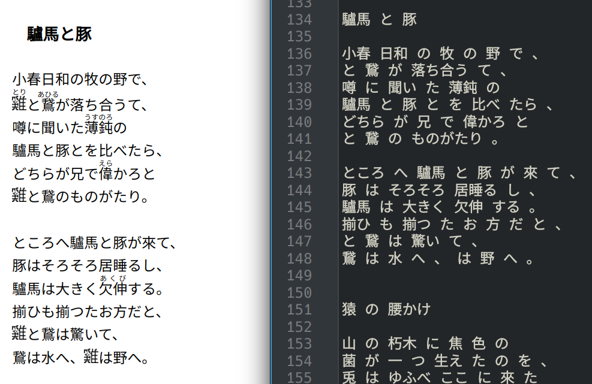

# Aozora Corpus Builder

## Introduction

This is a short Python script to make a plain-text "corpus" of the literature in Japanese digital archive [Aozora Bunko](https://www.aozora.gr.jp). It transforms Aozora HTML files into plain-text versions usable common analysis software by:

- Converting from Shift-JIS to UTF-8 encoding (implicitly)
- Removing annotations and inline metadata, including ruby glosses and HTML tags
- Inserting spaces between words

The project readme is much longer than the code itself! It's meant as a tutorial and resource (via the Aozora example) 
for some [common technical issues](#japanese-text-topics) involved in processing Japanese-language documents.


### Requirements

- Python 3 with:
    - [Beautiful Soup 4](https://pypi.org/project/beautifulsoup4/)
    - [mecab-python3](https://pypi.org/project/mecab-python3/)
    - [html5lib](https://pypi.org/project/html5lib/) (as Beautiful Soup parser)
- Data:
    - Have `git` installed for command-line use (suggested, for cloning Aozora files)
    - [Aozora Bunko work text files (HTML version)](#get-the-data-files)
    - [Aozora Bunko metadata CSV (extended, UTF-8)](#get-the-data-files)
- Install [MeCab](https://taku910.github.io/mecab/) (if not installed by mecab-python3 automatically)
- Download [近代文語UniDic](https://clrd.ninjal.ac.jp/unidic/download_all.html#unidic_kindai) (UniDic for Modern Literary Japanese, suggested)


## Background

I started working with Aozora as a side project with some colleagues who wanted to create a dataset for analysis. I 
hope my code and writeup can serve others who are self-orienting to what can seem like a daunting technical area (until you have a toolbox to deal with it).

Aozora Bunko is a high-quality, freely-available digital archive of modern Japanese documents. It's a popular choice 
for text analysis for those reasons alone. Some other features include:

- Machine-readable texts with accuracy checked by humans (in an area where OCR is lacking)
- Structured markup for language features and text boundaries, reliably separating "the content" vs. annotations
- Official CSV of detailed metadata for all files
- Good case study for learning to solve common technical issues in data preparation of transcribed historical 
  documents or even fairly recent Japanese webpages

My approach is a little different from many other projects for Aozora data:

- Uses **Aozora HTML files** (not .txt versions) and the markup provided by human 
  transcribers
- Takes advantage of HTML parser for overall more-reliable annotation removal, while relying on more-efficient 
  regex for ruby stripping as the most resource-intensive task
- Uses the **official metadata CSV** to build a full file list for processing, avoid ad-hoc scraping from the 
  source data
- Performs tokenization by word only, inserting a space between each segmented "word" to produce a dataset in the 
  basic form for most analysis software
  - I don't use the MeCab processing options that produce an entire data structure of info per-word.
  - One important reason for this: **the dictionary most suited to tokenizing Aozora only works with MeCab's simple 
    word-segmentation option** `-Owakati`
- Also see the [list of "what this project doesn't do" below](#what-this-project-does-not-do) and the [links to 
  projects](#other-aozora-projects) that _do_ deal with aspects I decided not to!


## Get started

### Get the data files

1. Clone or download this repo first. Navigate to the main project directory that contains `aozora.py`.
2. Using git, shallow clone [this mirror of Aozora HTML files](https://github.com/takahashim/aozorabunko_html) (avoids downloading a lot of unused files).
    - _If you don't have or want to install git, just use the clone function from the Github repository webpage._
    - Example using Linux command line: `git clone --depth 1 'https://github.com/takahashim/aozorabunko_html' && rm -rf aozorabunko_html/.git`
    - If the mirror isn't available, shallow clone [the official Aozora repository](https://github.com/aozorabunko/aozorabunko) instead, and rename the repo folder to `aozorabunko_html` to match the script. You will only need the `cards` subfolder and can delete the rest.
3. Download and unzip the complete, UTF-8 metadata CSV 「公開中　作家別作品一覧拡充版：全て(CSV形式、UTF-8、zip圧縮）」 from the [author list page](https://www.aozora.gr.jp/index_pages/person_all.html) at Aozora Bunko.


### Set up MeCab and dictionary

_If you prefer untokenized output, just comment out the MeCab setup and tokenization lines of the script._

I recommend using 近代文語UniDic with MeCab for tokenization. It most closely matches the language in Aozora texts (from 
100+ years ago) for better word-splitting results.

[Download](https://clrd.ninjal.ac.jp/unidic/download_all.html#unidic_kindai) and extract the dictionary (just a folder 
with files in it) to the project directory. Make sure the value of `DICT_PATH` at the top of the script 
matches the name of this folder exactly.


#### Troubleshooting

Did you receive a `RuntimeError: Failed initializing MeCab` that complains about the dictionary path not found? Try 
providing the absolute path to the dictionary folder to make sure MeCab is looking in the right place.  For example:

`DICT_PATH = '/home/your_username/projects/aozora/60a_kindai-bungo'`.


#### Why not configure with mecabrc?

This script sets up the MeCab tagger to ignore the `mecabrc` config file and specifies the dictionary to use directly.

Like me, you may have your MeCab binary installed automatically via `mecab-python3` _and_ you use a Python 
environment manager, such as conda. This common scenario will make the file and install locations very 
different from what many MeCab setup guides show. Using the command line option ended up beign more reliable (I can be 
certain it's using the dictionary I intended!) and saved me a lot of frustration.


## Running the script

1. Confirm directory structure and file locations match what is expected:

```
.
├── 60a_kindai-bungo/
├── aozorabunko_html/
│   ├── cards/
│   │   ├── 000005/
│   │   │   └── files/
│   │   │       ├── 5_21310.html
│   │   │       ├── 53194_45356.html
│   │   │       ├── 55215_49913.html
│   │   │       ├── 55216_49911.html
│   │   │       └── 55217_49912.html
│   │   ├── 000006/
│   │   │   └── files/
│   │   │       ├── 1868_22437.html
│   │   │       ├── 1869_33656.html
│   │   │       ├── 3310_8291.html
...

├── aozora.py
├── aozora_missing_maintext.txt
├── list_person_all_extended_utf8.csv
└── readme.md
```

2. Navigate to the main project folder and run `python aozora.py`.
3. When finished:
    - The output files are saved in folder `tokenized/` (created by the script first if needed).
    - The enhanced metadata file `t-list_person_all_extended_utf8.csv` is saved in the main project directory.


### Processing steps in detail

After initializing a list of files to process from the metadata CSV, the script goes through steps for each HTML file:

1. Open with Shift-JIS encoding specified, and any errors ignored. This is a simple but crucial step for Japanese files that aren't UTF-8 (Aozora or otherwise).
2. Using regular expressions (regex) for efficiency, strip out ruby glosses and markup, retaining the "base" 
   annotated phrase in its original place inline.
    - **If you want to do something different for handling ruby,** modify the code in `strip_ruby()`. For example, 
      retain more info in your output texts or save glosses elsewhere instead of just discarding everything.
    - Non-standard, older files have a custom ruby markup pattern, so there are separate functions and 
      variables (ending in `_old`) for handling the actual removal process for these outliers.
3. Use Beautiful Soup to look for (and return using `.extract`) the work contents in `<div class="main_text"> `, 
   handling markup removal depending on the length of the resulting object:
    - Standard Aozora HTML files, the vast majority, have exactly 1 tag with `main_text` class so I test for this number
      explicitly.
    - If the length is 0 _but_ the file contains a `<body>` tag, the file is one of the few non-standard [oldest data 
      files](#old-data-files). In this case, return all text enclosed in `<body>`.
    - _Any other length, and/or absence of HTML body tag, is treated as an unhandled outlier._ No tokenized 
      output file will be saved or recorded in metadata CSV for these files.
4. Insert spaces between words in the resulting text using MeCab.
5. Write the contents out with UTF-8 encoding (not Shift-JIS) to a .txt file and add the filename to 
   the metadata dictionary.
    - This will overwrite any existing file in the `tokenized/` directory that has the same name! This will only be an 
      issue if you've run this script before and want to retain multiple versions of output.
6. When all individual files have been processed, save the metadata dictionary as a CSV (with a different name from 
   the Aozora-sourced CSV).
    - This will overwrite any existing file with the same name!


## Final output

- One UTF-8 text file per work in the `tokenized/` directory, containing a word-tokenized version of the main text only
    - Line breaks in these files is visually the same as the original HTML versions rendered in a browser.
    - Output files are all in one directory, not in many subdirectories like the original Aozora repo.
    - To ensure unique filenames and avoid data loss, the filename is structured as 
      non-duplicate subdirectory path + filename of the original HTML files. (ex. `t-001257-files-59898_70731.txt`)
- `t-list_person_all_extended_utf8.csv` enhanced metadata file, saved in the main project directory
    - One row per unique file, containing all original associated metadata from Aozora CSV
    - Added column for tokenized output `.txt` filename
      - **Note: If the tokenized filename column is blank, no output was saved for that work.** This means the processing 
        failed for some reason.


## Known issues

### Beautiful Soup warning

I chose to suppress the Beautiful Soup warning that each input file "looks like XML, not 
HTML." You will often encounter this warning with Japanese documents but is usually safe to ignore, as in this case.


### What this project does not do

- I don't tokenize sentence-by-sentence with MeCab.
    - This script tokenizes **line by line** (broadly, think of it as by-paragraph) and retains original line breaks 
      in output.
    - Sentence parsing here is more complicated than seemed justified for performance or result quality.
- I don't store annotations or ruby information, just retain inline "original" text. The output will look like the 
  glosses never existed.
- Conversely, I don't do any special handling of non-ruby annotations or notes and their non-HTML markup. They're 
  retained as-is.
- Because the official Aozora CSV is more complete and correct, I don't extract or use any metadata from Aozora HTML 
  files themselves.
- I don't try to strictly keep metadata out of the output of the [140 oldest files](#old-data-files).
- I don't use the list of files missing `<div class="main_text">` to skip testing for non-standard cases (even if I 
  don't think it's likely those legacy files will be updated now).
    - _Since this is meant as a tutorial example, I wanted to show the initial logic that found them!_
- I don't try to include ["missing" characters 外字](https://www.w3.
  org/International/articles/missing-char-glyph/index.en) from source data files in the output, as Unicode or 
  otherwise. **Output from this script simply omits both the characters and Aozora-hosted placeholder images.**
    - These characters are only represented by images (not text), because they weren't available for input when the texts were published. Aozora displays the small images when you're viewing works in a web browser, readable for human eyes, and it doesn't appear anything is "missing" until you look in the source files.
    - For example, compare lines 137, 141, 147, and 148 of the tokenized output (on the right) to the browser-rendered Aozora HTML on the left:




## Notes on the source data

### About the Aozora metadata CSV

- The "linking field" to connect Aozora URLs and your local files is in `XHTML/HTMLファイルURL`, by substituting `https://www.aozora.gr.jp/` with `aozorabunko_html/cards/`.
- The Aozora CSV is oriented by author, not work (作品). As a result it contains duplicate rows from the perspective of individual works.
    - For example: Work ID (作品ID) 59898 has two corresponding rows, because there is both an author (Washington Irving) and a translator (Yoshida Kinetarō). The CSV considers them multiple author entires, so they each get a row with the same work listed -- even though those two rows are identical.
    - By contrast, this script is work-oriented. **The final output CSV contains metadata about each work processed, one per row and no duplicates.** It's saved separately without overwriting the Aozora-provided CSV.
- The CSV contains a bit of metadata for some number of works hosted on sites other than Aozora, which are ignored here. (They're not downloaded as part of the Aozora repo and don't have the HTML format this script expects, so it can't process them anyway.)
- Some other interesting fields include:
    - [NDC classification](https://en.wikipedia.org/wiki/Nippon_Decimal_Classification) (use to categorize or filter by subject)
    - When a work was first released on Aozora, plus whether and when it was updated since
    - Filter which works are in or out of copyright (per current Japanese law)
    - Details about the source that the Aozora version was transcribed from, versus original publication year and venue


### Fun facts about Aozora HTML files

- On the website and in the repo, all "works" (作品) full-text files are leaf nodes in paths like `cards/ddddd/files/dddd_ddddd.html` (where d is a digit). For example:

```
├── cards
│   └── 002265
│       └── files
│           ├── 62103_76815.html
│           └── 62104_76817.html
```
- There are **a handful of duplicate html filenames** located in different directories. This is why I used both the 
  folder and file ID for output file naming!
- All HTML files use Shift-JIS encoding and need to (at least) be converted to UTF-8 to work with most non-Japanese software.
- IMHO, the HTML files are by far the most useful of the formats Aozora offers (including plain-text or niche ebook 
  files), because of the human-provided semantic markup.
  - Two clear examples are:
    - ruby
    - info about the images used as placeholders for missing characters
  - You could try to use patterns to locate and extract this info from the .txt equivalents, but why 
    not use well-structured markup that's already doing the work for you? (Yes, I'm using regex for the simple 
    string-relacement task of stripping ruby from HTML files here, but the HTML made my work so much easier.)
- Ruby HTML markup looks like:

```
    <ruby>
        <rb>glossedtext</rb>
        <rp>startpunctuation</rp>
        <rt>gloss</rt>
        <rp>endpunctuation</rp>
    </ruby>
```

### Old data files

140 of the oldest files (uploaded in 1990s-early 2000s) have specific issues:

- They don't use the standard HTML formatting, markup tags, or `<ruby>` tags that all other Aozora files have. These use an `<!R>word (gloss)` format and are handled with regular expression matching, not Beautiful Soup.
- They are inconsistent (among themselves) in how metadata vs. work text are formatted using HTML. Without consistent formatting it's difficult to automate and get the right results.

I decided to err on the side of not distinguishing metadata at the end of the `body` tag, instead just including it 
along with the work text. All affected files are listed in `aozora_missing_maintext.txt`, included in this repo.


## Further resources

### Japanese text topics

- Ruby and HTML:
    - [W3C HTML Ruby Markup Extensions](https://www.w3.org/TR/html-ruby-extensions/)
    - [ruby tag demo and examples (MDN Web Docs)](https://developer.mozilla.org/en-US/docs/Web/HTML/Element/ruby)
- Encodings:
    - sci.lang.japan FAQ on [Encodings of Japanese](https://www.sljfaq.org/afaq/encodings.html)
    - [Unicode in Japan: Guide to a technical and psychological struggle](https://web.archive.org/web/20090627072117/http://www.jbrowse.com/text/unij.html) (archived) for even more historical, linguistic, 
      and technical detail on characters and encoding
- This (archived) English-language blog on [Cleaning Japanese Text](https://web.archive.org/web/20200906030113/https://kairozu.github.io/updates/cleaning-jp-text) walks through finding sentence 
  boundaries for tokenization purposes using Python.
  - Here's a [current link to the project it talks about](https://github.com/hologramber/Japanese-Text-Analysis/tree/master/jp-text-cleaning)


### Aozora files and their formatting

- [Aozora Bunko documentation for annotation and markup](http://www.aozora.gr.jp/annotation/henkoten.html) for .txt and 
  HTML files (Japanese only)
- [Aozora Bunko documentation on handling missing characters 外字](https://www.aozora.gr.jp/annotation/external_character.html) with images and markup tags
- [Aozora Bunko FAQ on images used for missing characters 外字](https://www.aozora.gr.jp/guide/aozora_bunko_faq.html#midashi900)
- [Aozora epub converter](https://github.com/hmdev/AozoraEpub3) has a very dense and info-packed readme on aspects of Aozora HTML files (Japanese only)


### Other Aozora projects

Here are some other relevant Aozora projects that I looked into while deciding what to tackle (or not) in mine.

- [Aozorahack Github collection](https://github.com/aozorahack)
- Other approaches to making a corpus from Aozora texts:
    - [aozorabunko Word2Vec Builder](https://github.com/eggplants/aovec) (includes pre-built model downloads)
    - [Aozora Bunko Corpus Generator](https://github.com/borh/aozora-corpus-generator) converts some missing characters to Unicode-equivalents
- Simple Aozora-specific file cleanup:
    - [aozorabunko-extractor](https://github.com/hppRC/aozorabunko-extractor/blob/main/src/aozorabunko_extractor/cli.py) (symbol cleanup and ruby removal plus sentence tokenization with konoha, using Aozora txt files)
    - [aozoraconv](https://github.com/takahashim/aozoraconv) (converts Shift-JIS to Unicode)
    - [aozora-split](https://github.com/probabilityhill/aozora-split) (split into sentences, tokenize, then store output in a Python pickle object)
- [Yozora](https://yozora.main.jp/) has some interesting presentations of Aozora metadata
- Enhanced [Aozora Bunko full-text and metadata search](https://textual-optics-lab.uchicago.edu/aozora) by University of Chicago's Textual Optics Lab


## Reuse

Copyright Molly Des Jardin

I made this small project for personal use and am not actively maintaining or adding to it. Please feel free to take, 
reuse, and/or improve on the code or tutorial (readme) in your own projects!


*MIT License*

Permission is hereby granted, free of charge, to any person obtaining a copy of this software and associated documentation files (the "Software"), to deal in the Software without restriction, including without limitation the rights to use, copy, modify, merge, publish, distribute, sublicense, and/or sell copies of the Software, and to permit persons to whom the Software is furnished to do so, subject to the following conditions:

The above copyright notice and this permission notice shall be included in all copies or substantial portions of the Software.

THE SOFTWARE IS PROVIDED "AS IS", WITHOUT WARRANTY OF ANY KIND, EXPRESS OR IMPLIED, INCLUDING BUT NOT LIMITED TO THE WARRANTIES OF MERCHANTABILITY, FITNESS FOR A PARTICULAR PURPOSE AND NONINFRINGEMENT. IN NO EVENT SHALL THE AUTHORS OR COPYRIGHT HOLDERS BE LIABLE FOR ANY CLAIM, DAMAGES OR OTHER LIABILITY, WHETHER IN AN ACTION OF CONTRACT, TORT OR OTHERWISE, ARISING FROM, OUT OF OR IN CONNECTION WITH THE SOFTWARE OR THE USE OR OTHER DEALINGS IN THE SOFTWARE.
